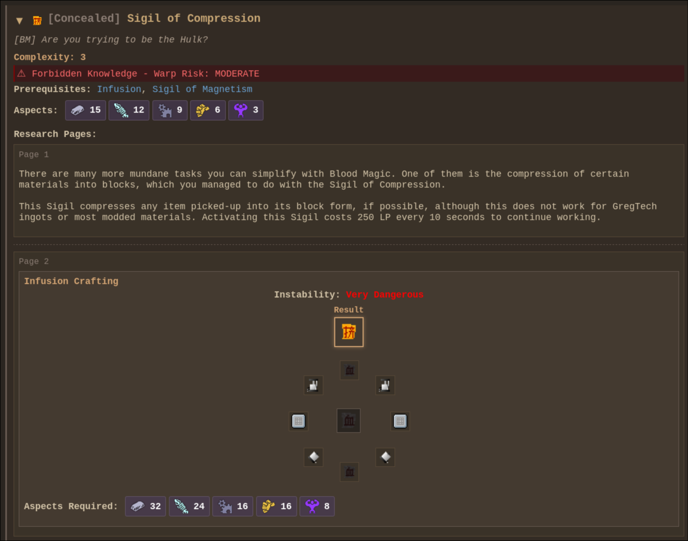

# FentLib
A shared code library and tweak/fix mod.


[](https://github.com/JackOfNoneTrades/FentLib/releases)
[](https://www.curseforge.com/minecraft/mc-mods/fentlib)
[](https://modrinth.com/mod/fentlib)
[](https://67.fentanylsolutions.org/mod/fentlib)
[](https://maven.fentanylsolutions.org/#/releases/org/fentanylsolutions/fentlib/FentLib)

[](https://discord.gg/xAWCqGrguG)

<!--[]()-->

## Features
* Support for animated GIF server icons. Just drop a `server-icon.gif` file in the server root directory. Size limits are configurable. HodgePodge is a soft dependency, required if you want to use larger GIFs (because of the packet size limit).

Use the `/reload_icon` command to reload the icon. Also works for `server-icon.png`.
* Removal of EnderCore / HodgePodge Info Button in the mod list screen.
* API to modify the `S00PacketServerInfo` packet. Example:
```java
public class ClientProxy extends CommonProxy {
    @Override
    public void preInit(FMLPreInitializationEvent event) {
      S00PacketServerInfoModifyService.registerDeserializeHandler((response, fentlibData, serverData) -> {
        if (fentlibData.has("server_to_client_payload")) {
          // Yoohoo we got something back!!!!
          // serverData contains stuff like server IP
        }
      });
    }
}

public class CommonProxy {
  public void preInit(FMLPreInitializationEvent event) {
    if (MiscUtil.isServer()) {
      S00PacketServerInfoModifyService.registerHandler((response, fentLibPresent) -> {
        // fentLibPresent is just a boolean indicating whether fentlib is loaded
        return "server_to_client_payload";
        // You can return a String, a S00PacketServerInfoModifyService.KeyValue, or a JsonElement. If you return
        // a non-null value, it will be passed back to the client
      });
    }
  }
}
```
* `/dump_thaumonomicon <Optional Comment>` command. Run it from the client, and all Thaumcraft research will be dumped as a static website. The comment will be visible under the page title, and you can indicate the pack or mods for with which the dump was done.

* `/warpdim` [dimension ID] command. Painlessly warp to a dimension (meant for debugging).
* `SessionAccessTokenOverrideMixin` allows overriding the session access token in dev launches via `-Dfentlib.accessTokenOverride=<token>`.
* Client sound utilities to set a custom max attenuation distance without increasing the sound volume. Methods:
```java
SoundUtil.withMaxDistance(ISound sound, float maxDistance);
SoundUtil.playWithMaxDistance(ISound sound, float maxDistance);
SoundUtil.playWithMaxDistance(SoundHandler soundHandler, ISound sound, float maxDistance);
SoundUtil.playAt(ResourceLocation soundResource, double x, double y, double z, float volume, float pitch, float maxDistance);
```
Example:
```java
SoundUtil.playAt(waveSound, x, y, z, 0.25F, 1.0F, 64.0F);
```
* HTTP-on-Minecraft-port reverse proxying for local web UIs. Configure path-to-port mappings in `fentlib/http-port-routes.json` so services like Dynmap can be reached through the server port, such as `/dynmap/...`, instead of separate ports.
Set `publicBaseUrl` in `config/fentlib/fentlib.cfg` to the public base URL of the server; mods should append their own relative route paths on top of it.
* QOI image format support and utils thanks to [saharNooby/qoi-java](https://github.com/saharNooby/qoi-java). For usage example, check out how support for `server-icon.qoi` is implemented.
* WebP image format support and utils thanks to [haraldk/TwelveMonkeys](https://github.com/haraldk/TwelveMonkeys). For usage example, check out how support for `server-icon.webp` is implemented.

## Fishing Loot Config
Set `enableFishingLootTable=true` in `config/fentlib/fentlib.cfg` to enable FentLib's fishing override. The loot table lives at `config/fentlib/fishing-loot.json`. When enabled, vanilla still decides whether a catch is `fish`, `junk`, or `treasure`, but the item itself comes only from this JSON.

The JSON has top-level `fish`, `junk`, and `treasure` lists. Each entry uses vanilla-style `weight`, supports `count` and `meta` ranges, can be limited to a biome whitelist with `biomes` or inverted into a blacklist with `invertBiomes`, and biome selectors can be numeric IDs, biome names, or `*` to match any biome. Entries can also use explicit numeric enchant IDs or `useVanillaEnchantingRules` for vanilla-style random enchanting.

```json
{
  "fish": [
    {
      "item": "minecraft:fish",
      "weight": 60,
      "count": { "min": 1, "max": 1 },
      "meta": { "min": 0, "max": 0 }
    },
    {
      "item": "minecraft:fish",
      "weight": 10,
      "count": { "min": 1, "max": 2 },
      "meta": { "min": 1, "max": 1 },
      "biomes": ["ocean", "river"]
    }
  ]
}
```

## Dependencies
* [UniMixins](https://modrinth.com/mod/unimixins) [](https://www.curseforge.com/minecraft/mc-mods/unimixins) [](https://modrinth.com/mod/unimixins/versions) [](https://github.com/LegacyModdingMC/UniMixins/releases)

## Building

`./gradlew build`.

## Credits
* [GT:NH buildscript](https://github.com/GTNewHorizons/ExampleMod1.7.10)

## License

`LgplV3 + SNEED`.

## Buy me a coffee

* [ko-fi.com](https://ko-fi.com/jackisasubtlejoke)
* Monero: `893tQ56jWt7czBsqAGPq8J5BDnYVCg2tvKpvwTcMY1LS79iDabopdxoUzNLEZtRTH4ewAcKLJ4DM4V41fvrJGHgeKArxwmJ`

<br>


